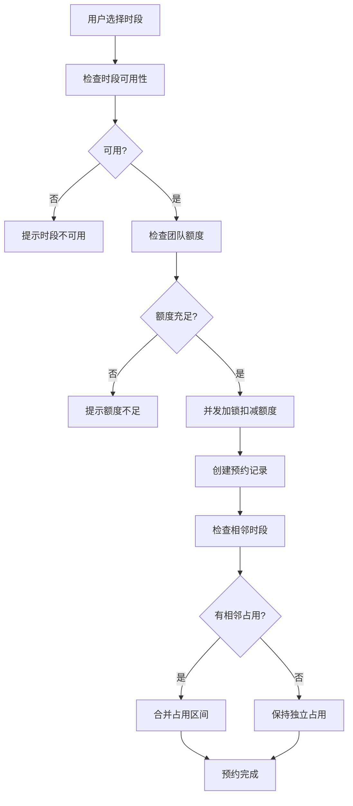

## 1. 产品概述
攀岩馆场次预约Web应用，面向攀岩场馆运营团队和客户团体，解决岩壁道资源排期、团队共享额度、并发预约扣减等核心问题。通过时段合并/拆分机制优化资源利用效率，通过并发加锁机制保证额度实时一致性。

- 目标用户：攀岩馆运营人员、团队客户（企业团建、俱乐部等）
- 核心价值：提升岩壁道资源利用率、保障团队额度准确性、简化预约退订流程

## 2. 核心功能

### 2.1 用户角色
| 角色 | 注册方式 | 核心权限 |
|------|---------|----------|
| 运营管理员 | 系统预置 | 岩壁道资源管理、查看所有预约、额度管理 |
| 团队客户 | 账号注册 | 查看岩壁道排期、预约/退订场次、查看团队额度、装备租赁 |

### 2.2 功能模块
1. **岩壁道排期模块**：岩壁道资源建档、时段配置、日历视图展示
2. **占用合并拆分模块**：连续时段自动合并、中途退订智能拆分
3. **共享额度模块**：团队额度池管理、额度分配、余额查询
4. **并发扣减模块**：多人并发预约加锁、实时余额一致性保证
5. **安全装备租赁模块**：装备库存管理、预约时租赁装备

### 2.3 页面详情
| 页面名称 | 模块名称 | 功能描述 |
|---------|---------|----------|
| 首页仪表盘 | 数据概览 | 今日预约数、岩壁道使用率、额度消耗统计、待处理提醒 |
| 岩壁道管理 | 岩壁道排期 | 岩壁道资源列表、新增/编辑岩壁道、难度等级配置、时段设置 |
| 排期日历 | 占用合并拆分 | 周/日视图日历、拖拽预约、连续时段高亮合并显示 |
| 预约管理 | 占用合并拆分 | 预约列表、新建预约、退订操作、占用合并/拆分状态展示 |
| 团队额度 | 共享额度 | 团队列表、额度池配置、额度流水记录、实时余额展示 |
| 装备租赁 | 安全装备租赁 | 装备类型管理、库存管理、预约关联租赁、归还登记 |

## 3. 核心流程

### 3.1 预约流程
用户选择岩壁道和时段 → 系统检查时段可用性 → 检查团队额度余额 → 并发加锁扣减额度 → 创建预约记录 → 相邻时段自动合并 → 返回预约成功

### 3.2 退订流程
用户选择预约记录 → 判断是否为合并占用 → 若是则拆分占用区间 → 释放对应额度 → 更新额度池余额 → 返回退订成功

## 4. 用户界面设计

### 4.1 设计风格
- **设计风格**：工业/运动风格，结合攀岩运动的力量感与现代简约
- **主色调**：深灰蓝色 (#1e293b) 作为主背景，橙红色 (#f97316) 作为强调色（攀岩绳的颜色）
- **辅助色**：石灰绿 (#10b981) 表示可用状态，酒红色 (#ef4444) 表示已占用
- **字体**：标题使用粗体无衬线字体，正文使用清晰易读的系统字体
- **按钮风格**：圆角中等 (6px)，悬停有微缩放和阴影变化
- **卡片风格**：轻微阴影 + 边框，悬停时阴影加深
- **图标风格**：线性图标，与运动主题呼应

### 4.2 页面设计概述
| 页面名称 | 模块名称 | UI元素 |
|---------|---------|--------|
| 首页仪表盘 | 数据概览 | 统计卡片网格、折线图、快速操作按钮、深色主题 |
| 岩壁道管理 | 资源列表 | 卡片式列表、难度等级标签、编辑弹窗 |
| 排期日历 | 日历视图 | 时间轴网格、拖拽选择、合并占用高亮、悬浮详情 |
| 预约管理 | 预约列表 | 表格视图、状态标签、操作按钮组 |
| 团队额度 | 额度管理 | 额度进度条、流水记录时间线、充值弹窗 |
| 装备租赁 | 装备管理 | 装备卡片、库存指示、租赁记录 |

### 4.3 响应式
- 桌面端优先设计，适配 1280px 及以上
- 平板端：侧边栏折叠，内容区域自适应
- 移动端：导航变为底部Tab，日历简化为列表视图

### 4.4 交互动效
- 页面加载：卡片渐入 + 轻微上移动画
- 时段选择：点击时缩放反馈，连续选中时连接线动画
- 额度变化：数字跳动动画 + 进度条平滑过渡
- 合并/拆分：占用块平滑延展/收缩动画
