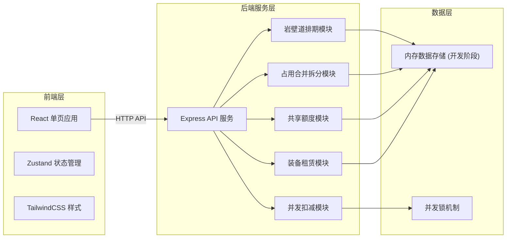
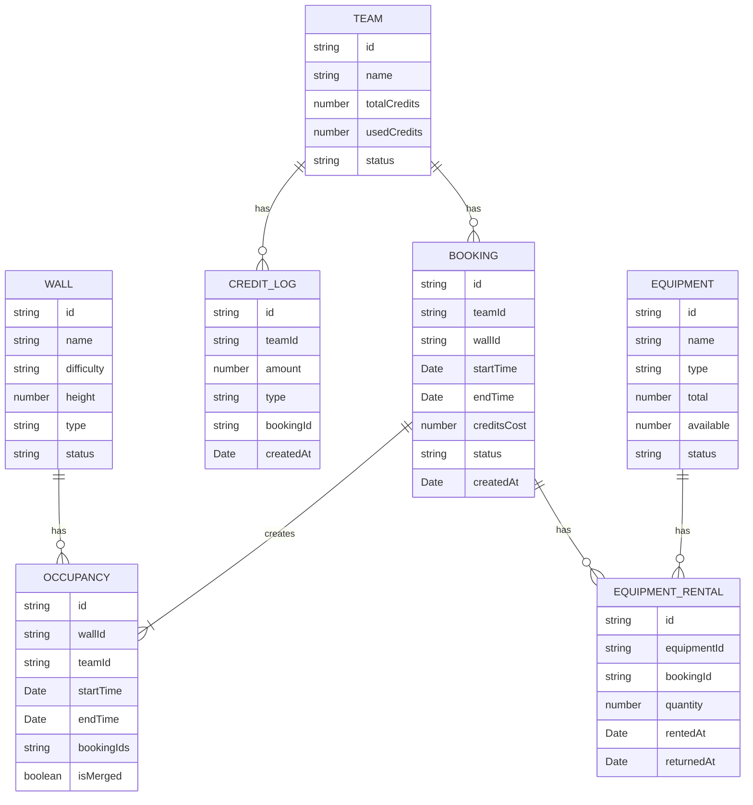

## 1. 架构设计



## 2. 技术选型

- **前端**: React@18 + TypeScript + Vite + TailwindCSS@3 + Zustand + React Router
- **后端**: Express@4 + TypeScript
- **状态管理**: Zustand (轻量级状态管理)
- **数据存储**: 内存存储 (开发演示)，可扩展至 SQLite/PostgreSQL
- **图标库**: lucide-react
- **并发控制**: 基于 Promise 的内存锁机制

## 3. 路由定义

### 前端路由
| 路由路径 | 页面名称 | 功能描述 |
|---------|---------|----------|
| / | 首页仪表盘 | 数据概览和快速操作 |
| /walls | 岩壁道管理 | 岩壁道资源CRUD |
| /schedule | 排期日历 | 日历视图、预约操作 |
| /bookings | 预约管理 | 预约列表、退订操作 |
| /credits | 团队额度 | 额度池管理、流水记录 |
| /equipment | 装备租赁 | 装备管理、租赁记录 |

### 后端API路由
| 方法 | 路径 | 功能描述 |
|-----|------|----------|
| GET | /api/walls | 获取岩壁道列表 |
| POST | /api/walls | 创建岩壁道 |
| PUT | /api/walls/:id | 更新岩壁道 |
| DELETE | /api/walls/:id | 删除岩壁道 |
| GET | /api/bookings | 获取预约列表 |
| POST | /api/bookings | 创建预约 (含并发扣减、合并占用) |
| DELETE | /api/bookings/:id | 取消预约 (含拆分占用、释放额度) |
| GET | /api/occupancies | 获取占用列表 (合并后的) |
| GET | /api/teams | 获取团队列表 |
| POST | /api/teams | 创建团队 |
| GET | /api/teams/:id/credits | 获取团队额度余额 |
| POST | /api/teams/:id/credits/recharge | 额度充值 |
| GET | /api/teams/:id/credit-logs | 额度流水记录 |
| GET | /api/equipment | 获取装备列表 |
| POST | /api/equipment/rentals | 创建租赁 |
| POST | /api/equipment/rentals/:id/return | 归还装备 |

## 4. 核心模块设计

### 4.1 岩壁道排期模块
- 岩壁道资源实体：id、名称、难度等级、高度、类型、状态
- 时段配置：每日营业时间段、单时段时长（默认1小时）

### 4.2 占用合并拆分模块
- 占用实体：id、岩壁道ID、团队ID、开始时间、结束时间、预约ID列表、是否合并
- 合并策略：同一团队、同一岩壁道、时间连续或重叠的预约自动合并
- 拆分策略：取消合并占用中的部分时段时，拆分为前后两段独立占用

### 4.3 共享额度模块
- 团队实体：id、名称、总额度、已用额度、状态
- 额度流水：id、团队ID、变动量、类型(消费/充值/退款)、关联预约ID、时间

### 4.4 并发扣减模块
- 基于团队ID的分布式锁（内存实现）
- 扣减流程：获取锁 → 校验余额 → 扣减额度 → 释放锁
- 保证原子性，防止超卖

### 4.5 装备租赁模块
- 装备实体：id、名称、类型、总数、可用数、状态
- 租赁记录：id、装备ID、预约ID、数量、租赁时间、归还时间

## 5. 数据模型



## 6. 关键算法

### 6.1 占用合并算法
1. 获取目标岩壁道当天所有占用
2. 按开始时间排序
3. 遍历检查相邻占用：同一团队且时间连续（前一个结束 == 后一个开始）
4. 合并为一个占用记录，记录所有关联的预约ID

### 6.2 占用拆分算法
1. 找到包含目标预约的合并占用
2. 从合并占用中移除目标预约时段
3. 检查剩余时段是否断裂
4. 若断裂则拆分为多个独立占用

### 6.3 并发扣减算法
```
function deductCredits(teamId, amount):
    lock = acquireLock(teamId)  // 获取团队锁
    try:
        team = getTeam(teamId)
        if team.availableCredits < amount:
            throw Error("额度不足")
        team.usedCredits += amount
        saveTeam(team)
        return true
    finally:
        releaseLock(teamId, lock)
```

## 7. 项目结构

```
src/                    # 前端源码
  components/          # 通用组件
  pages/               # 页面组件
  hooks/               # 自定义Hooks
  utils/               # 工具函数
  store/               # Zustand状态管理
  types/               # TypeScript类型定义
api/                   # 后端源码
  routes/              # API路由
  services/            # 业务逻辑
  models/              # 数据模型
  utils/               # 工具函数
  data/                # 内存数据存储
shared/                # 共享类型定义
```
